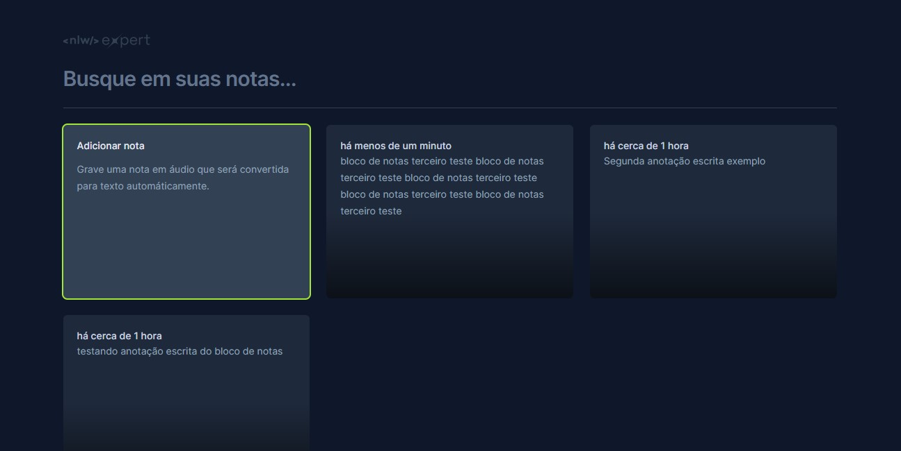

<h1 align="center">Bloco de Notas NLW-Expert</h1>

Projeto realizado no evento NLW Expert da plataforma Rocketseat

  

✅ Tecnologias

Esse projeto foi desenvolvido com as seguintes tecnologias :
- ReactJS
- TailwindCSS
- Typescript
- HTML
- CSS
- Git e Github
- Figma
- Vite (para tooling)
- APIs da Web (Web storage e Web speech)

💻 Projeto

O projeto foi desenvolvido no evento NLW Expert da plataforma Rocketseat. Durante três dias foram construidos os projetos, realizei a trilha de ReactJS, onde o objetivo era a realização de um bloco de notas que tem como função fazer anotações diretamente escritas e também em forma de áudio que seriam transcritas em texto logo em seguida, também podendo excluir a nota e pesquisar por palavras.